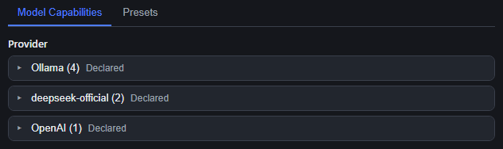
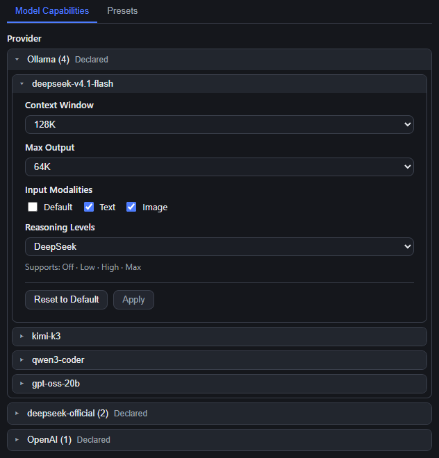
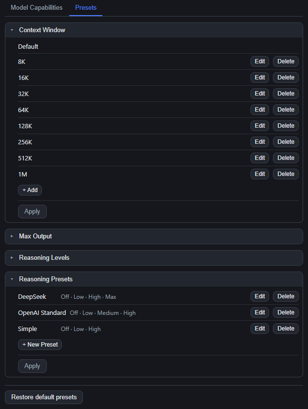

# dsh-model-tweaks

[中文](README.md) | English

A DSH (DeepSeek Harness) web plugin: adds a **Model Capabilities** page to Settings for managing each model's context window, max output, input modalities and reasoning levels, plus the plugin's own global preset lists.

Supports DSH `0.1.7-rc.2` and later (0.1.x).

## What it does

- Location: Settings → **Model Capabilities** (two tabs: Model Capabilities / Presets).
- **Two-level collapsible cards**: click a provider card title to open the group, click a model card title to select it and expand its capability editor inside the card (click again to collapse).
- Four fields: **Context Window**, **Max Output**, **Input Modalities** (Text / Image only — DSH has no audio/video), **Reasoning Levels** (dropdown: Default / Global / named preset / Custom…).
- **Draft + Apply**: only the `Apply` inside that model's editor writes to `settings.yaml` under `llm-pi-ai`. `Reset to Default` is a draft action too — it still needs `Apply`.
- Choosing `Default` **deletes** the field (never `null`/`0`/an empty object) and hands the value back to the DSH engine.





## Presets

The `Presets` tab manages four plugin-owned lists. Each one is a card, and **every card has its own Apply at the bottom** (draft mode as well):

| Card              | Built-in contents                                                                                                  |
| ----------------- | ------------------------------------------------------------------------------------------------------------------ |
| Context Window    | Default, 8K, 16K, 32K, 64K, 128K, 256K, 512K, 1M (decimal 8000…1000000)                                            |
| Max Output        | Default, 4K, 8K, 16K, 32K, 64K, 128K, 256K                                                                         |
| Reasoning Levels  | off, minimal, low, medium, high, xhigh, max (add / edit / delete / reorder)                                        |
| Reasoning Presets | DeepSeek · OpenAI Standard · Simple (each starts with `off`; create, edit, delete, reuse across models) |

- Stored in `{DSH_HOME}/dsh-model-tweaks/presets.json`; a missing or broken file falls back to the built-in defaults instead of failing.
- `Restore default presets` at the bottom of the page brings back the built-in lists.
- One `Apply` submits the **whole** preset document — one document is never half-saved.



## Install

> Installing changes the profile config under `%USERPROFILE%\.dsh` and requires a DSH restart (which interrupts running sessions). Confirm before installing.

Repository: <https://github.com/AkotaP/dsh-model-tweaks>

**Install from the Plugin page**: sidebar → **Plugin** → **Add plugin**, and enter the repository address `https://github.com/AkotaP/dsh-model-tweaks` (the same field also takes the npm package name `dsh-model-tweaks`, an absolute local directory, or a tarball). DSH probes the repository with `git ls-remote` before handing the spec to pnpm; afterwards check that the entry is enabled in the list.

**One command** (the equivalent):

```powershell
dsh plugin --profile desktop add https://github.com/AkotaP/dsh-model-tweaks
# once published to npm: dsh plugin --profile desktop add dsh-model-tweaks
```

**Let an agent install it** (paste this into an agent running in DSH):

> Install this repository into the current DSH desktop profile: `https://github.com/AkotaP/dsh-model-tweaks`. Use **Add plugin** on the sidebar's Plugin page, or `dsh plugin --profile desktop add https://github.com/AkotaP/dsh-model-tweaks`. Then confirm the profile's `dsh.profile.bundles` lists `dsh-model-tweaks`, **ask me first** before restarting DSH, and after the restart verify that the Model Capabilities tab appears in Settings.

Restart DSH afterwards and the **Model Capabilities** tab appears in Settings. To uninstall: remove it from the Plugin page, or run `dsh plugin --profile desktop remove dsh-model-tweaks` (and make sure `dsh.profile.bundles` no longer lists it).

> ⚠️ The first save materializes that provider's whole `models` array into the user layer of `settings.yaml` (existing DSH behaviour — the official Models page does the same), which then shadows the same provider's list in `cordis.patch.yml`. **To recover**, delete the entire `llm-pi-ai.providers.<provider>.models` key from `settings.yaml`.

## Test

```powershell
node --test        # same as pnpm test; run from the repository root
```

Fully offline — no DSH and no browser. `test/support/harness.mjs` loads the built artifacts `lib/index.js` / `lib/client.js` through a stub module graph and a minimal React.

| Test file                   | Contracts it pins                                                                                                                                                                                                                             |
| --------------------------- | --------------------------------------------------------------------------------------------------------------------------------------------------------------------------------------------------------------------------------------------- |
| `test/manifest.test.mjs`    | The three ids that must agree (`cordis.patch.yml` `insert.id` / `__ModuleLoader__.load({id})` / the host's exported `name`), `dsh.client.inject`, the host must not import an undeclared `@deepseek-ai/*`, built-in defaults identical on both halves |
| `test/host-api.test.mjs`    | API fences (403/405/404/415/413), `get` enumeration plus `effective`/`userDeclared`, the whole-array `save` shape and Default = delete the field, out-of-range thinking level → 400, `settings-conflict` 409, preset-file fallback              |
| `test/client-page.test.mjs` | Both tabs and the four controls, `Input Modalities` has no Audio/Video, draft semantics (no write on change, exactly one save per Apply, Default → `null`), card collapse/selection, per-card Apply, CSS injected after removing the stale tag     |

---

MIT. See [CHANGELOG.md](CHANGELOG.md) for the change history; implementation notes live in [docs/HANDOFF.md](docs/HANDOFF.md) and the interface contract is [docs/CONTRACT.md](docs/CONTRACT.md).
