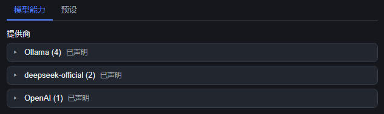
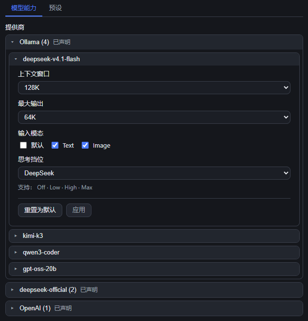
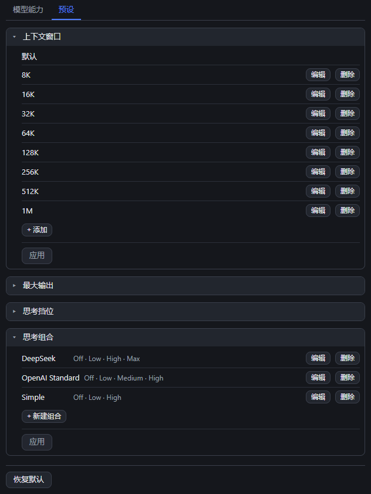

# dsh-model-tweaks

[English](README.en.md) | 中文

DSH（DeepSeek Harness）Web 插件：在「设置」里多一个 **模型能力** 页面，用来管理每个模型的上下文窗口、最大输出、输入模态、思考挡位，以及插件自管的全局预设。

## 作用

- 位置：设置 → **模型能力**（页内两个页签：模型能力 / 预设）。
- **卡片式两级折叠**：点供应商卡片标题 → 展开该组，点模型卡片标题 → 选中并在卡片内展开它的能力编辑区（再点一次收起）。
- 四个字段：**上下文窗口**、**最大输出**、**输入模态**（只有 Text / Image，DSH 没有 audio/video）、**思考挡位**（下拉：Default / Global / 命名组合 / Custom…）。
- **草稿 + Apply**：只有该模型编辑区里的 `Apply` 时才写进 `settings.yaml` 的 `llm-pi-ai`。`重置为默认` 也只是草稿，仍需 `Apply`。
- 选 `Default` = 该字段**被删除**（不写 `null`/`0`/空对象），回落由 DSH 引擎决定；`Apply` 之后下拉里显示的就是真实值。





## 预设功能

`预设` 页管四份插件自管的列表，同样是卡片，**每张卡片底部有它自己的 Apply**（同样是草稿模式，改动不即时落盘）：

| 卡片       | 内置内容                                                                                      |
| ---------- | --------------------------------------------------------------------------------------------- |
| 上下文窗口 | Default, 8K, 16K, 32K, 64K, 128K, 256K, 512K, 1M（十进制 8000…1000000）                      |
| 最大输出   | Default, 4K, 8K, 16K, 32K, 64K, 128K, 256K                                                    |
| 思考挡位   | off, minimal, low, medium, high, xhigh, max（可增删改、上下排序）                             |
| 思考组合   | DeepSeek · OpenAI Standard · Simple（都以 `off` 开头，可新建 / 编辑 / 删除 / 跨模型复用） |

- 存到 `{DSH_HOME}/dsh-model-tweaks/presets.json`；文件不存在或损坏时回落内置默认，不会报错。
- 页面底部 `恢复默认预设` 一键回到内置列表。
- 一次 `Apply` 提交的是**整份**预设文档（同一份文档不允许半保存）。



## 安装

> 安装会改动 `%USERPROFILE%\.dsh` 下的 profile 配置，并且需要重启 DSH（重启会打断正在跑的会话）。请确认后执行。

仓库：<https://github.com/AkotaP/dsh-model-tweaks>

**兼容性**：支持 DSH `^0.1.7-rc.2`（写在 `peerDependencies` 的 `@deepseek-ai/dsh`）。DSH 在安装和启动时都会校验这个范围，不匹配会拒绝安装；确实需要时可用 `dsh plugin allow-version <包@版本> --dsh-version <版本>` 对确切版本做一次豁免。

**在「插件」页里装**：侧边栏「插件」→「添加插件」，填入仓库地址 `https://github.com/AkotaP/dsh-model-tweaks`（同处也接受 npm 包名 `dsh-model-tweaks`、本地目录绝对路径和 tarball）。DSH 会先用 `git ls-remote` 探一次仓库再交给 pnpm，装完在列表里确认它是启用状态。

**一条命令**（等价写法）：

```powershell
dsh plugin --profile desktop add https://github.com/AkotaP/dsh-model-tweaks
# 发布到 npm 之后可以直接用包名：dsh plugin --profile desktop add dsh-model-tweaks
```

**让 agent 装**（把下面这段发给 DSH 里的 agent）：

> 把这个仓库装进当前 DSH 的 desktop profile：`https://github.com/AkotaP/dsh-model-tweaks`。用侧边栏「插件」页的「添加插件」，或 `dsh plugin --profile desktop add https://github.com/AkotaP/dsh-model-tweaks`。装完确认 profile 的 `dsh.profile.bundles` 里已经有 `dsh-model-tweaks`，然后**先问我**再重启 DSH，重启后确认设置里出现「模型能力」页签。

装好后**重启 DSH**，设置里出现「模型能力」页签。卸载：侧边栏「插件」页里卸载，或 `dsh plugin --profile desktop remove dsh-model-tweaks`（并确认 `dsh.profile.bundles` 里已移除该项）。

> ⚠️ 首次保存会把该 provider 的 `models` 整数组写进 `settings.yaml` 用户层（DSH 既有机制，官方 Models 页同理），之后 `cordis.patch.yml` 里同 provider 的模型改动会被它盖住。**恢复方法**：删掉 `settings.yaml` 里 `llm-pi-ai.providers.<provider>.models` 整个键。

## 测试

```powershell
node --test        # 等价于 pnpm test；在仓库根目录跑
```

离线，不需要 DSH、也不需要浏览器：`test/support/harness.mjs` 用 stub 模块图 + 迷你 React 直接加载构建产物 `lib/index.js` / `lib/client.js`。

| 测试文件                      | 锁住的契约                                                                                                                                                                                                            |
| ----------------------------- | --------------------------------------------------------------------------------------------------------------------------------------------------------------------------------------------------------------------- |
| `test/manifest.test.mjs`    | 三处 id 必须一致（`cordis.patch.yml` 的 `insert.id` / `__ModuleLoader__.load({id})` / host 导出的 `name`）、`dsh.client.inject`、host 不得 import 未声明的 `@deepseek-ai/*`、内置默认预设与 host 逐字一致 |
| `test/host-api.test.mjs`    | API 围栏（403/405/404/415/413）、`get` 的枚举与 `effective`/`userDeclared`、`save` 的整数组写入与 Default = 删字段、思考挡位越界 400、`settings-conflict` 409、预设文件回落                                 |
| `test/client-page.test.mjs` | 两个页签与四个控件语义、`Input Modalities` 不含 Audio/Video、草稿语义（改动不写盘、Apply 恰好一次 save、Default → `null`）、卡片折叠与选中、每张卡片自己的 Apply、CSS 先删后插                                   |

---

MIT。变更记录见 [CHANGELOG.md](CHANGELOG.md)；实现与踩坑（工程约定、harness 用法、主题 token 纪律）见 [docs/HANDOFF.md](docs/HANDOFF.md)，接口契约见 [docs/CONTRACT.md](docs/CONTRACT.md)。
